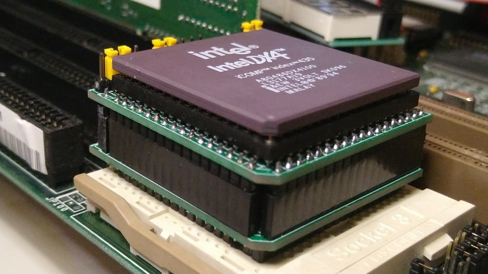

# 486 Sandwich Socket Blaster

The 486 Sandwich Socket Blaster is an alternative design for the [486SocketBlaster](https://github.com/scrapcomputing/486SocketBlaster) that is much easier to solder and put together.
It is a simple voltage adapter / interposer for 486 processors that allows you to use a 3-volt 486 CPU on an older 5-volt-only motherboard.
For example you can use a DX4 or an Am5x86 on an old 486 motherboard that would normally only work with 5-volt CPUs.
This basically converts any 3-volt CPU to an "Overdrive".

> [Warning!]
> This design is *VERY* experimental and is unstable when used with some motherboards. You have been warned!

# How does it work ?

It is really simple: All CPU pins are passed through to the motherboard socket, except for the Vcc.
Those are connected to the output of a the on-board voltage regulator or a mini buck converter that can be soldered to the board.

# Soldering/Assembly Instructions

The adapter includes two parts: the top and bottom part, both of which use the exact same PCB.
The two parts connect to each other with standard 2.54mm-pitch pin-headers, the top part with male headers and the bottom part with female headers.
The top part accepts the CPU with either a female 168-pin BGA socket, or an equivalent collection of female headers.
The bottom part is for the pins that insert into the motherboard socket.
The pins are made of widely available pin-headers.

## Solder Jumpers
These need to be set differently for the top and bottom parts (see silk-screen).

# Voltage regulator

The Sandwich Socket Blaster can be powered by a regulator circuit that can be soldered to the board based on the AP7176B chip, or by an of-the-shelf mini buck converter.
Unlike the original Socket Blaster, this only accepts the small voltage buck converter (18mm x 12mm), usually found using keywords like "mini buck converter".
These are commonly rated at up to 3A of current.
Given that 3-volt 486 CPUs are usually very efficient (the DX4-100 is rated at max 3.55/5.22W typical/max) such a regulator should be adequate in most cases.
For best stability try to source a good quality part.

If you are planning to overclock or to use a more power hungry CPU, please use an external regulation circuit plugged in to the `EXTPWR` header, or use a *very* good quality mini buck converter.

# WARNING!!!

Please make sure you know what you are doing!
Improper assembly/settings/use can damage both your precious motherboard and your precious CPU!

# Features

- You can choose between an soldered-on linear regulator circuit or a mini buck converter.
- External Power Header. This can be used either for monitoring the CPU voltage, or for providing power externally, either with an external power supply or an external voltage regulator.
- CLKMUL Header for selecting/overriding the CPU multiplier. This controls CPU pin `R17`. 1-2 connects it to the motherboard socket pin and 2-3 connects it to ground. This reduces the multiplier of a DX4 to 2x (66MHz) and sets the multiplier of an Am5x86 to 4x (133MHz).
- WB/WT Header for selecting/overriding Write-Back/Write-Through cache. This controls processor CPU pin `B13` (which is the `CLKMUL` pin in earlier 486 CPUs). 1-2 connects it to the motherboard socket pin, and 2-3 connects it to Vcc, which enables Write-Back.
- STPCLK pin for use with the Throttle Blaster. This connects directly to CPU pin `G15`, which in DX4 and 5x86 CPUs is the STPCLK pin. This allows you to throttle down the CPU and achieve the whole range of speeds from the original IBM PC all the way to the max speed the CPU can provide.

# Bill of materials

Item                                               | ##  | Description
---------------------------------------------------|-----|--------------------------------------------------------
486 Sandwich Socket Blaster PCB                    | 2   | We need 2 identical boards, one for the top and one for the bottom.
mini buck converter (or AP7176B)                   | 1   | We only the small 18mm x 12mm ones. These usually have chips like MP1584, MP2307 and others
AP7176B MSOP-8EP 3.3mm P0.65mm (or mini buck)      | 1   | Modern linear voltage regulator, alternative to the mini buck converter
SMD Ceramic capacitor 10uf 10+V 1206 (for AP7176B) | 2   | To be used with the AP7176B regulator
SMD Ceramic capacitor  1uf 10+V 1206 (for AP7176B) | 1   | To be used with the AP7176B regulator
SMD Ceramic capacitor 10uf 10+V 1206               | 4   | For CPU pin voltage stability
2x11 female pin-header 2.54mm pitch                | 2   | Connects top/bottom PCBs
2x11 male pin-header 2.54mm pitch                  | 2   | Connects top/bottom PCBs
2x6 female pin-header 2.54mm pitch                 | 2   | Connects top/bottom PCBs
2x6 male pin-header 2.54mm pitch                   | 2   | Connects top/bottom PCBs
1x16 female pin-header 2.54mm pitch                | 2   | Connects top/bottom PCBs
1x16 male pin-header 2.54mm pitch                  | 2   | Connects top/bottom PCBs
1x19 female pin-header 2.54mm pitch                | 1   | Connects top/bottom PCBs
1x19 male pin-header 2.54mm pitch                  | 1   | Connects top/bottom PCBs
1x18 female pin-header 2.54mm pitch                | 1   | Connects top/bottom PCBs
1x18 male pin-header 2.54mm pitch                  | 1   | Connects top/bottom PCBs
40pin SIP pin header (male)                        | 5   | Single-row round (machined) pin 2.54mm pitch (male). Socket pin diameter: 0.50mm (see photo below)
40pin SIP socket header (female)                   | 5   | Single-row round (machined) pin sockets, 2.54mm pitch (see photo below) 
3-pin header 2.54mm pitch                          | 2   | (optional) Headers for CLKMUL, WB/WT
2-pin header 2.54mm pitch                          | 1   | (optional) Header for STPCLK
1-pin header 2.54mm pitch                          | 1   | (optional) For connecting the Throttle Blaster to STPCLK.
Jumper 2.54mm pitch                                | 2   | (optional) Jumpers for the CLKMUL and WB/WT headers

Gerber files can be found in the releases: https://github.com/scrapcomputing/486SandwichSocketBlaster/releases

Please note that the headers used for the socket pins (bottom board) are a very tight fit. So please make sure that you get headers of the correct pin diameter.
